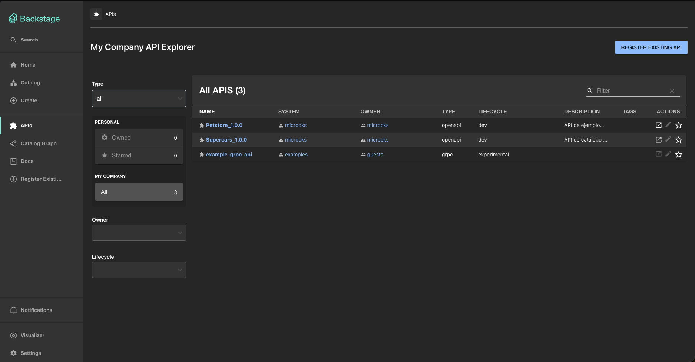
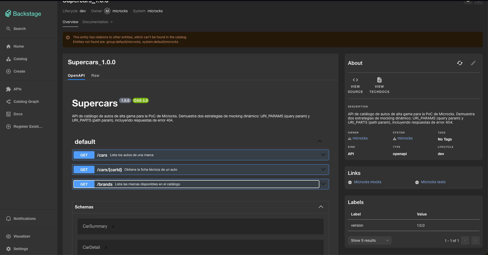

# =====================================================================
# Análisis del Catálogo de APIs en Backstage
# =====================================================================

## Fecha: 20 de septiembre de 2026
## Nombre:

### 1. Información visible de la API en el catálogo

El **Microcks Entity Provider** descubrió automáticamente las dos APIs importadas en Microcks, **`Petstore_1.0.0`** y **`Supercars_1.0.0`**, sin registrar ningún `catalog-info.yaml`. Consulta Microcks cada 2 minutos y las crea como entidades `kind: API`.

Para cada API, Backstage muestra:

| Sección | Campo | Valor (Supercars) | Origen |
|---|---|---|---|
| Encabezado | **Nombre** | `Supercars_1.0.0` | `{nombre}_{versión}` del servicio en Microcks |
| About | **Kind** | `API` | Tipo de entidad creada por el provider |
| About | **Type** | `openapi` | Tipo de contrato (REST → `openapi`) |
| About | **Lifecycle** | `dev` | Nombre de la instancia del provider en `app-config.yaml` (`microcksApiEntity.dev`) |
| About | **Owner** | `microcks` | Valor por defecto: el servicio no tiene la etiqueta `team` (`ownerLabel`) |
| About | **System** | `microcks` | Valor por defecto: el servicio no tiene la etiqueta `domain` (`systemLabel`) |
| About | **Description** | Texto de `info.description` | Contrato OpenAPI |
| About | **Tags** | *No Tags* | — |
| Labels | **version** | `1.0.0` | Agregado por el provider |
| Links | **Microcks mocks** / **Microcks tests** | Enlaces a la UI de Microcks | Generados por el provider |
| Definition | **Documentación interactiva OpenAPI** | Endpoints, parámetros, ejemplos y schemas | Contrato completo (`spec.definition`) |
| Consumers / Providers | Componentes relacionados | *"No component consumes this API"* | Sin relaciones declaradas |

La pestaña **Definition** renderiza el contrato con Swagger UI: `GET /cars`, `GET /cars/{carId}`, `GET /brands` y los schemas `CarSummary`, `CarDetail`, `Brand` y `Error`. Al agregar `GET /brands` al contrato y reimportarlo en Microcks, el endpoint apareció en Backstage en la siguiente sincronización (≤ 2 min) sin ningún paso manual en el portal. Ese es el ciclo **Contrato → Mock → Catálogo**.

**Observación:** Backstage muestra el aviso *"This entity has relations to other entities, which can't be found in the catalog: group:default/microcks, system:default/microcks"*. El provider asigna owner y system `microcks` por defecto, pero esas entidades no existen en el catálogo. En un entorno real se corrige etiquetando los servicios en Microcks (`team: <equipo>`, `domain: <sistema>`) y registrando los `Group` y `System` correspondientes. Así cada API queda con un dueño real y trazable.

### 2. Valor del catálogo centralizado para equipos grandes

En un equipo de más de 50 ingenieros, el registro manual no escala: depende de que cada persona recuerde crear y mantener un `catalog-info.yaml` por API. En la práctica, el catálogo termina incompleto o desactualizado respecto a lo que realmente está desplegado. Con el descubrimiento automático, la fuente de verdad es el contrato publicado en Microcks: toda API importada aparece en Backstage sin esfuerzo adicional, y sus cambios (como el nuevo `GET /brands`) se reflejan solos en minutos.

Esto elimina la desalineación entre la documentación y el contrato real, porque la pestaña *Definition* se genera del mismo contrato que usan los mocks. Los equipos ya no tienen que preguntar en chats o buscar en repositorios qué APIs existen, quién es su dueño o cómo se consumen: todo está en un único portal con buscador, filtros por owner/lifecycle/type y enlaces directos a los mocks y pruebas.

También reduce la duplicación de trabajo. Antes de construir una API nueva, un equipo puede descubrir que otra ya expone esa capacidad, y un equipo consumidor puede integrarse de inmediato contra el mock de Microcks sin esperar al backend. Por último, un catálogo automático permite aplicar gobernanza a escala: detectar APIs sin dueño (como el aviso de `group:default/microcks`), estandarizar etiquetas y medir qué componentes dependen de cada API.

### 3. Diferencia entre Component y API en Backstage

En el modelo de datos de Backstage (*descriptor format*), un **`Component`** es una pieza de software concreta: un servicio backend, un sitio web, una librería o una aplicación. Tiene un repositorio, un ciclo de vida y un equipo dueño, y se describe con `spec.type` (`service`, `website`, `library`…), `spec.lifecycle` y `spec.owner`. Un **`API`** es la **interfaz o contrato** mediante el cual un componente expone funcionalidad a otros. Se describe con `spec.type` (`openapi`, `asyncapi`, `grpc`, `graphql`) y `spec.definition`, que contiene el contrato completo que Backstage renderiza en la pestaña *Definition*.

La diferencia clave es **implementación vs. contrato**: el Component es *quién hace el trabajo* y la API es *cómo se habla con él*. Se relacionan de forma explícita:

- Un Component declara **`spec.providesApis`** para indicar que implementa y expone una API.
- Un Component declara **`spec.consumesApis`** para indicar que depende de una API de otro.

Separarlos permite que una API exista antes que su implementación, como en esta PoC: `Supercars_1.0.0` está en el catálogo y tiene mocks funcionales en Microcks aunque ningún servicio real la implemente todavía. Por eso Backstage muestra *"No component consumes this API"*. También permite que un mismo Component exponga varias APIs y que Backstage construya el grafo de dependencias (*Catalog Graph*) para analizar el impacto de un cambio de contrato sobre sus consumidores.

| | `Component` | `API` |
|---|---|---|
| Representa | La implementación (servicio, web, librería) | El contrato / interfaz expuesta |
| `spec.type` típico | `service`, `website`, `library` | `openapi`, `asyncapi`, `grpc`, `graphql` |
| Campo distintivo | `providesApis`, `consumesApis`, `dependsOn` | `definition` (el contrato completo) |
| En esta PoC | No existe aún (backend no implementado) | `Supercars_1.0.0`, `Petstore_1.0.0` (desde Microcks) |
